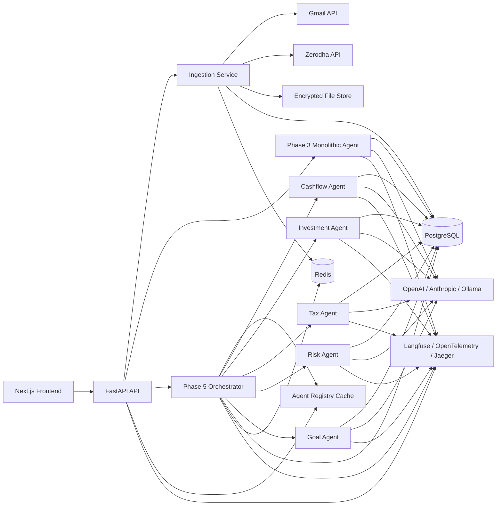
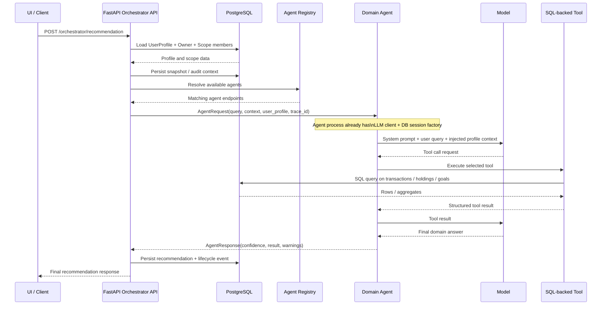
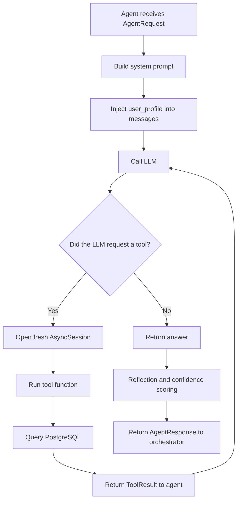
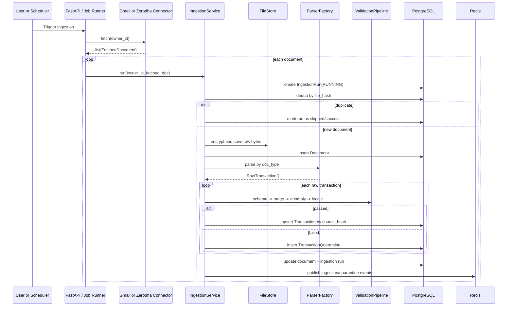
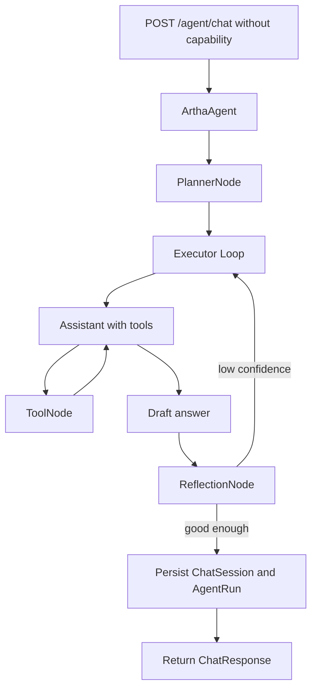
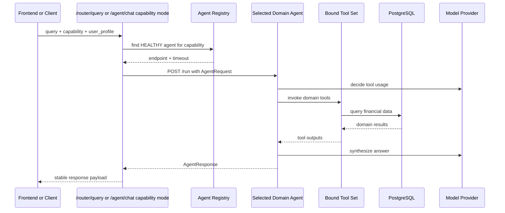
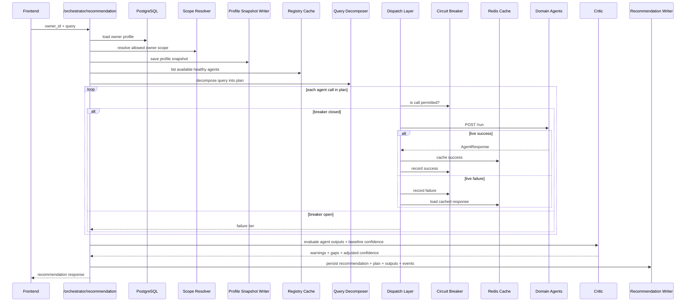
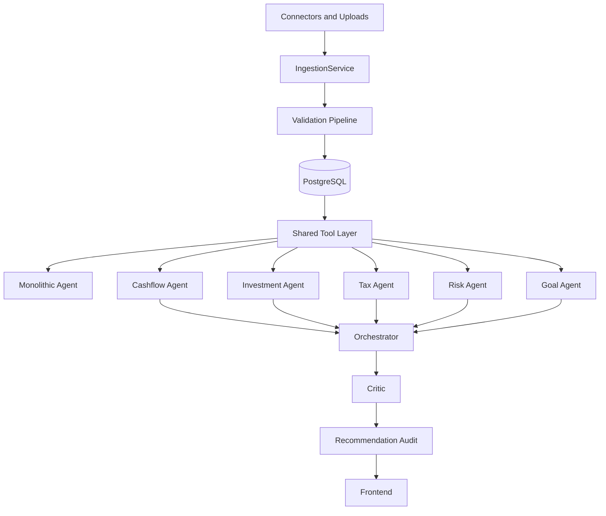

# Artha Architecture Onboarding

This guide is for someone joining the project and trying to understand how the system is put together today.

It focuses on four things:

1. What design patterns are present in the codebase
2. What agents exist in the system
3. What technology stack is implemented
4. How the agents apply those patterns in real request flows

It also includes end-to-end diagrams for the two major product paths:

- Data ingestion and normalization
- Advisory and recommendation generation

## 1. Executive Summary

Artha is a personal finance advisory platform with two major halves:

- A data platform that ingests financial records from documents and APIs, validates them, stores them, and publishes ingestion events
- An advisory layer that answers user questions and generates recommendations using either:
  - a legacy monolithic LangGraph agent, or
  - a newer multi-agent architecture with specialized domain agents and an orchestrator

The codebase has clearly evolved in phases:

- Phase 1-2: ingestion, validation, persistence
- Phase 3: monolithic reasoning agent
- Phase 4: specialized domain agents behind a registry/router
- Phase 5: planner + critic orchestrator that composes multiple agent outputs

That means the project is not "one architecture"; it is an architecture that has grown in layers. Understanding that evolution makes the folder structure much easier to follow.

## 2. High-Level System Map

### 2.1 Low-Level Advisory Runtime Flow

The diagram above is intentionally architectural. At runtime, the important detail is that the LLM does not open a database connection by itself.

Instead:

- the orchestrator loads profile and scope data from PostgreSQL
- the orchestrator sends that context to one or more domain agents
- each domain agent owns an LLM client and a bounded set of tools
- the LLM decides when to call a tool
- the tool implementation queries PostgreSQL and returns structured data
- the LLM synthesizes a finance-domain answer from those tool results

That means a domain agent "touches both" the model and PostgreSQL, but through different responsibilities:

- model access is for planning, tool selection, synthesis, and reflection
- PostgreSQL access is for factual financial data retrieval

The sequence below shows the Phase 5 orchestrated recommendation path in more detail.

Inside a domain agent, the loop is even more direct:

Practical reading tip:

- if you are trying to understand "who loads profile data?", look at the orchestrator/router
- if you are trying to understand "who decides which financial query to run?", look at the LLM inside the domain agent
- if you are trying to understand "who actually executes SQL?", look at the tool implementations

## 3. Technology Stack

### Backend

- Python 3.12
- FastAPI for HTTP APIs
- SQLAlchemy 2.0 async ORM
- PostgreSQL for transactional storage
- Alembic for schema migrations
- Redis for pub/sub and agent response caching
- APScheduler for scheduled ingestion and registry refresh
- Pydantic v2 for schemas and validation

### AI / Agent Runtime

- LangGraph for agent graphs
- LangChain Core tools/messages
- LLM provider abstraction supporting:
  - Ollama
  - OpenAI
  - Anthropic

### Ingestion / Parsing

- Gmail API via `google-api-python-client`
- Zerodha Kite Connect
- `pdfplumber`, `pypdf`, `camelot-py`, `pdf2image`, `pytesseract`
- `cryptography` Fernet encryption for stored documents

### Frontend

- Next.js 14
- React 18
- TypeScript
- Tailwind CSS
- TanStack Query
- Radix UI primitives
- Recharts for visualization widgets

### Observability

- `structlog` for structured logs
- OpenTelemetry for tracing
- Langfuse for agent and LLM tracing
- Prometheus / Grafana / Jaeger in local infra

## 4. Main Architectural Building Blocks

### API Layer

The `api/` package is the system entrypoint. It exposes routers for:

- ingestion
- owners/accounts/goals/profile
- legacy monolithic chat
- capability-based domain routing
- multi-agent recommendation orchestration
- agent registry management

The API process also owns important app-level singletons:

- agent registry cache
- breaker store
- response cache
- in-process scheduler

### Ingestion Layer

The ingestion subsystem is responsible for getting raw financial data into a normalized internal form.

It is composed of:

- connectors: fetch raw documents or structured payloads
- parsers: convert bytes into `RawTransaction` records
- validation pipeline: schema, business rules, anomaly checks, locale normalization
- persistence: documents, transactions, quarantined records, ingestion runs
- notifications: publish ingestion results to Redis

### Agent Layer

There are two agent systems living side by side:

#### Phase 3 monolithic agent

One LangGraph-based agent handles planning, tool execution, reflection, persistence, and chat sessions in a single flow.

#### Phase 4-5 domain-agent system

Specialized agents are split by finance domain and deployed as separate FastAPI services.

Those agents are:

- `cashflow_agent`
- `investment_agent`
- `tax_agent`
- `risk_agent`
- `goal_agent`

### Orchestration Layer

The orchestrator is the coordination layer on top of domain agents. It performs:

- scope resolution
- query decomposition
- agent dispatch
- circuit breaking
- cache fallback
- confidence composition
- critic-based quality checks
- recommendation audit persistence

## 5. Design Patterns Used

This codebase uses several recognizable patterns. Some are classical object-oriented patterns; others are distributed systems patterns.

### 5.1 Layered Architecture

The most visible pattern is a layered architecture:

- `api/` handles transport
- `services/` handles business logic
- `libs/` holds shared domain models and utilities
- `frontend/` handles user experience

Why it matters:

- transport concerns stay out of the business layer
- business services can be reused by schedulers and APIs
- shared schemas can be used consistently across modules

### 5.2 Dependency Injection

Dependencies are passed into services instead of being hard-coded inside them.

Examples:

- `IngestionService` receives `AsyncSession`, `ValidationPipeline`, `FileStore`, and `NotificationClient`
- `BaseAgent` receives an async SQLAlchemy session factory and LLM config
- the API lifespan injects registry, breaker, and cache into `app.state`

Why it matters:

- easier testing
- simpler replacement of infrastructure pieces
- clearer boundaries between orchestration and implementation

### 5.3 Strategy Pattern

The system swaps behavior behind stable interfaces.

Examples:

- parser selection through `ParserFactory`
- multiple connector implementations behind `ConnectorABC`
- different LLM providers behind `LLMConfig`
- interchangeable breaker store via `BreakerStore` protocol

Why it matters:

- new data sources and models can be added with low impact
- orchestration code does not need to know implementation details

### 5.4 Factory Pattern

Factories are used to construct the right implementation at runtime.

Examples:

- parser selection in `services/ingestion/parsers/factory.py`
- domain agent FastAPI app creation in `services/agents/_common/fastapi_app.py`
- LLM config generation in `services/agents/_common/agent_config.py`

Why it matters:

- construction logic stays centralized
- calling code works with abstractions instead of creation details

### 5.5 Template Method Pattern

`BaseAgent` defines the common execution template for all domain agents:

1. unpack request
2. build prompt context
3. run assistant/tool loop
4. reflect on answer quality
5. compute freshness, confidence, risk
6. return standardized envelope

Subclasses only customize:

- `AGENT_ID`
- `CAPABILITIES`
- `_build_tools()`
- optionally `_system_prompt()`

Why it matters:

- all domain agents behave consistently
- new agents are added by filling in domain-specific details only

### 5.6 Registry Pattern

The multi-agent system uses a registry to discover available agents.

Examples:

- agents self-register on startup
- registry rows store endpoint, capabilities, timeout, fallback strategy, scope
- API keeps an in-memory cache of registry entries for dispatch planning

Why it matters:

- routing is dynamic
- agents can be independently deployed and updated
- orchestration does not rely on hard-coded service URLs

### 5.7 Adapter Pattern

Adapters convert between subsystem contracts.

Examples:

- `AgentRequest` and `AgentResponse` act as a stable envelope between router/orchestrator and domain agents
- Phase 4 routing maps `AgentResponse` back into the stable `ChatResponse`
- tools convert SQL/domain results into LLM-friendly string outputs

Why it matters:

- subsystems can evolve independently
- external callers get stable API shapes even when internals change

### 5.8 Pipeline Pattern

The ingestion validation flow is a classic sequential pipeline.

Stages:

1. schema validation
2. range validation
3. anomaly detection
4. locale normalization

Why it matters:

- failures are isolated to a stage
- quarantine reasoning is explicit
- each stage is independently testable

### 5.9 State Machine Pattern

The project uses state machines in multiple places:

- LangGraph node transitions in the monolithic agent
- reflection rerun loop
- circuit breaker state transitions: `CLOSED`, `OPEN`, `HALF_OPEN`
- recommendation lifecycle transitions in audit/event handling

Why it matters:

- complex agent and reliability behavior becomes explicit
- easier to reason about failure handling and retries

### 5.10 Circuit Breaker Pattern

The orchestrator protects itself from repeatedly calling failing agents.

Behavior:

- repeated failures open the breaker
- open breaker fails fast
- half-open allows a probe
- success closes the breaker again

Why it matters:

- prevents cascading failures
- avoids slow or stuck recommendation requests

### 5.11 Cache-Aside / Fallback Pattern

Successful domain agent responses are cached in Redis. On live failure:

- fresh cache -> `SECONDARY`
- stale cache -> `TERTIARY`
- no cache -> `FAILURE`

Why it matters:

- system can degrade gracefully
- recommendations still work when some agents are temporarily unavailable

### 5.12 Event-Driven Pattern

Some subsystems communicate through events instead of direct synchronous calls.

Examples:

- ingestion status published to Redis
- quarantine alerts published to Redis
- recommendation lifecycle stored as event records

Why it matters:

- decouples producers from future consumers
- supports real-time UX and auditability

### 5.13 Repository-Like Data Access Through Services and ORM Models

This codebase does not implement a strict repository class per aggregate, but it uses a repository-like style:

- services coordinate queries and writes
- ORM models represent persisted entities
- higher-level modules work with service functions instead of raw SQL everywhere

Why it matters:

- database logic stays somewhat localized
- business flows are easier to follow

## 6. What Agents Exist

There are two different meanings of "agent" in this repository.

### 6.1 The legacy monolithic agent

This is the `ArthaAgent` in `services/agent/agent.py`.

Responsibilities:

- plan a user query into steps
- call tools
- synthesize an answer
- reflect on answer quality
- persist chat session and run history

Use case:

- backward-compatible chat endpoint
- single-agent experience

### 6.2 The domain agents

These are separate, specialized services under `services/agents/`.

#### Cashflow Agent

Capabilities:

- cashflow
- spending
- budget

Tools:

- transaction query
- category analysis
- spending trend
- budget comparison
- upcoming expenses

Typical questions:

- "Where am I overspending?"
- "How has my grocery spending changed month over month?"

#### Investment Agent

Capabilities:

- investment
- portfolio
- net worth

Tools:

- net worth
- portfolio value

Typical questions:

- "What is my current portfolio value?"
- "How concentrated is my net worth in investments?"

#### Tax Agent

Capabilities:

- tax
- itr
- fiscal

Tools:

- tax summary
- transaction query

Typical questions:

- "What is my tax liability this year?"
- "Show tax-relevant entries for this fiscal year"

#### Risk Agent

Capabilities:

- risk
- insurance
- emergency fund
- debt

Tools:

- emergency fund months
- asset concentration
- debt to income
- insurance coverage gap

Typical questions:

- "Is my emergency fund adequate?"
- "Do I have an insurance gap?"

#### Goal Agent

Capabilities:

- goal
- planning
- savings

Tools:

- goal progress
- upcoming expenses

Typical questions:

- "Am I on track for my goals?"
- "Can I increase savings without hurting my monthly plan?"

### 6.3 The critic

The `critic` is not a separately deployed service in this codebase, but conceptually it behaves like a post-processing quality agent.

Responsibilities:

- check consistency across agent outputs
- penalize missing or inconsistent evidence
- reduce confidence when schema versions are unknown

It is deterministic rather than LLM-based in the current implementation.

## 7. How Agents Apply the Patterns

This is the most important part for understanding the code: the patterns are not theoretical. The agents actively use them.

### Domain agents as Template Method + Strategy

Every domain agent inherits the common runtime from `BaseAgent`.

The shared runtime handles:

- tracing
- LLM initialization
- planner/reflection reuse
- message compaction
- assistant-tool graph execution
- confidence scoring
- response envelope creation

Each concrete agent only contributes:

- a domain-specific tool strategy
- a capability set
- optional prompt specialization

So the domain-agent design is:

- Template Method for execution structure
- Strategy for toolset and domain behavior

### Router + registry as Service Discovery

The API does not hardcode domain agent endpoints. Instead:

- agents self-register
- registry stores their metadata
- router selects healthy agents by capability

So the multi-agent system uses:

- Registry pattern for discovery
- Adapter pattern for request/response normalization
- Strategy selection based on capability tags

### Orchestrator as Coordinator + Reliability Layer

The orchestrator applies multiple patterns at once:

- decomposer chooses which agents to call
- dispatcher executes calls in parallel
- breaker guards against bad dependencies
- cache provides degraded fallback
- critic validates result quality
- audit writer persists an explainable recommendation artifact

In other words, the orchestrator is the control plane for multi-agent collaboration.

### Monolithic agent as Graph-Based State Machine

The older `ArthaAgent` uses a LangGraph state machine:

- planner node
- executor loop
- reflection node

That path is still useful to understand because the domain-agent system reuses some of the same concepts:

- planning
- tool invocation
- reflection
- context compaction

The main difference is architectural placement:

- Phase 3 keeps everything in one agent
- Phase 4-5 distributes responsibilities across specialized services

## 8. End-to-End Flow: Data Ingestion

The ingestion flow is the foundation of everything else. If this flow is weak, the advisory outputs will be weak.

### Why this flow matters architecturally

- It is a pipeline with explicit failure isolation
- It protects core tables through quarantine
- It enforces idempotency twice:
  - file-level dedup with `file_hash`
  - transaction-level dedup with `source_hash`
- It creates the reliable data foundation that all agents read from

## 9. End-to-End Flow: Legacy Monolithic Chat

This is the older advisory path, but it still exists and is important for understanding the transition.

### What it demonstrates

- graph/state-machine design
- tool-augmented LLM workflow
- reflection/self-critique loop
- persistent chat sessions

## 10. End-to-End Flow: Capability-Based Domain Routing

This is the simplest modern multi-agent path.

### Why this matters

- the agent boundary is now a service boundary
- specialization reduces prompt/tool overload
- the registry decouples routing from deployment

## 11. End-to-End Flow: Orchestrated Recommendation

This is the most complete and most interesting path in the current architecture.

### What is strong about this flow

- it is auditable
- it handles partial failure
- it separates planning from execution from quality evaluation
- it gives the frontend structured outputs instead of one opaque answer

## 12. Frontend Interaction Model

The frontend is not just a UI shell; it is wired specifically to the orchestration model.

Main behavior:

- the dashboard "Ask Artha" widget stores chat thread locally
- when a user asks a question, the frontend calls `/orchestrator/recommendation`
- the assistant message stores the full recommendation payload
- UI components can show:
  - final answer text
  - confidence
  - per-agent timeline/output metadata

This means the frontend is designed around the Phase 5 orchestrator, not around the older monolithic chat path.

## 13. Data Model Concepts to Keep in Mind

A few shared concepts make the entire architecture easier to understand:

### Money invariant

Amounts are stored as paise integers, never floats.

Implication:

- tools, validators, schemas, and agents all assume integer money handling

### User profile injection

Agents do not fetch user profile context themselves. The profile is injected into requests.

Implication:

- agent services remain more deterministic
- cross-agent context stays consistent

### Agent envelope contract

All domain agents speak the same request/response format.

Implication:

- routing and orchestration logic stays generic
- any new domain agent can plug into the same ecosystem

### Auditability

Recommendations are persisted together with:

- the plan
- agent outputs
- confidence
- events/state transitions

Implication:

- recommendations are treated as reviewable artifacts, not just ephemeral chat text

## 14. Architectural Strengths

- Clear separation between ingestion and advisory logic
- Strong move toward service-oriented domain agents
- Good use of standard reliability patterns: breaker, cache fallback, registry
- Shared request/response contracts across agents
- Auditable recommendation flow
- Reusable common agent runtime through `BaseAgent`
- Data quality protections through validation + quarantine

## 15. Architectural Tradeoffs and Realities

This section is useful for onboarding because it explains what may feel "odd" at first glance.

### Two advisory architectures coexist

There is both:

- a monolithic LangGraph agent
- a distributed domain-agent system

This is not a bug; it is a sign of phased evolution. But it does mean new contributors need to know which path they are working on.

### Some infrastructure is intentionally local/in-process

Examples:

- APScheduler runs in-process
- breaker store is in-memory
- registry cache is in-memory

That is perfectly reasonable for current scope, but in a larger distributed deployment those may need shared backing stores.

### The critic is deterministic today

This is actually a strength for reliability and explainability, but it also means the critic is rule-limited rather than semantically rich.

### Domain agents reuse some monolithic-agent internals

The newer domain agents still reuse planner/reflection/context logic from the older agent system. That reduces duplication, but it also means the older design still influences the newer one.

## 16. Recommended Mental Model for a New Contributor

If you are new to Artha, the simplest mental model is:

1. Financial data enters through ingestion
2. Data becomes normalized rows in PostgreSQL
3. Tools query that normalized data
4. Agents use those tools to answer domain questions
5. The orchestrator coordinates multiple agents for broader recommendations
6. The frontend visualizes recommendation outputs and agent traces

Or even shorter:

- ingestion builds the truth
- tools expose the truth
- agents reason over the truth
- orchestrator combines specialized reasoning

## 17. Files Worth Reading First

If you want to continue from this document into the code, these are the best entry points:

- `api/main.py`
- `services/ingestion/ingestion_service.py`
- `services/validation/pipeline.py`
- `services/agent/agent.py`
- `services/agents/_common/base_agent.py`
- `services/orchestrator/decompose.py`
- `services/orchestrator/dispatch.py`
- `services/orchestrator/critic.py`
- `api/routers/orchestrator.py`
- `frontend/components/chat/AskArtha.tsx`

## 18. One-Screen Summary

---

If you are onboarding into implementation work, the most important distinction to keep in mind is this:

- `services/agent/` is the legacy single-agent reasoning path
- `services/agents/` plus `services/orchestrator/` is the newer multi-agent architecture

That one distinction explains most of the project structure.
