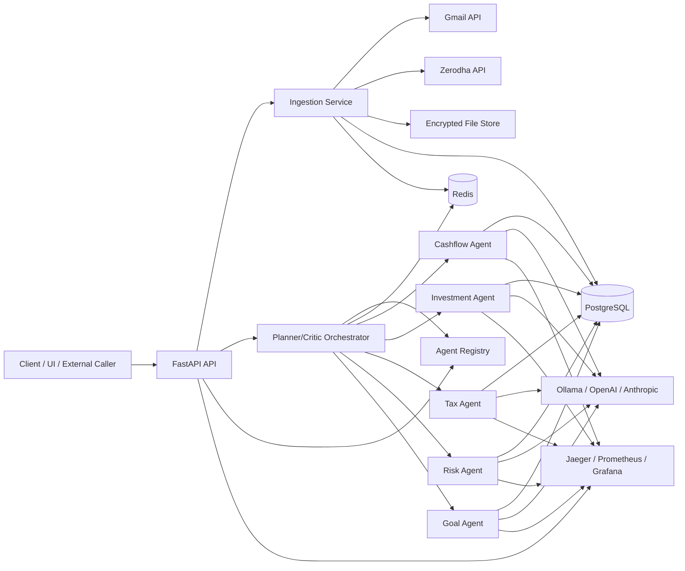
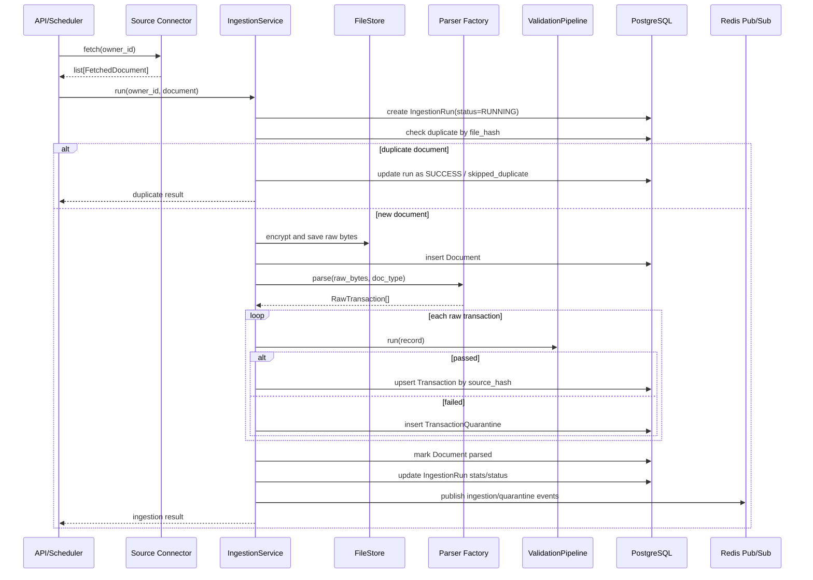
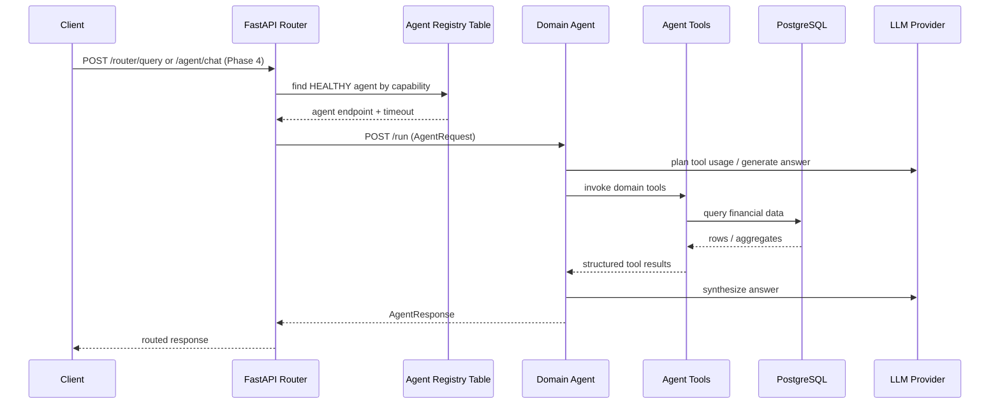
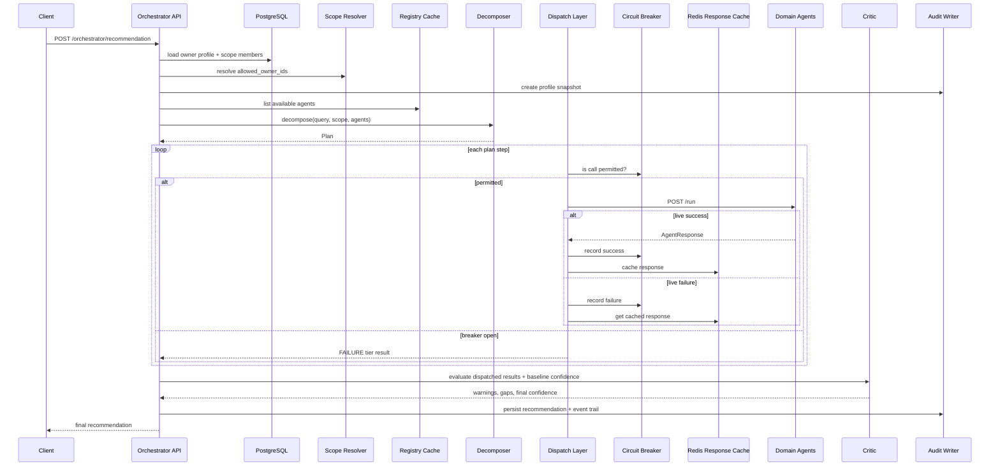

# Artha High-Level Technical Design

## 1. System Overview

### Purpose

Artha is a personal finance advisory backend that combines:

- A financial data ingestion platform for collecting and normalizing user financial records.
- An AI-assisted advisory layer for answering finance questions and generating recommendations.
- A multi-agent orchestration layer that routes queries to specialized domain agents such as cashflow, investment, tax, risk, and goals.

The codebase reflects an architecture evolving in phases:

- Phase 1-2: Data aggregation, parsing, validation, persistence.
- Phase 3: A monolithic reasoning agent with chat persistence.
- Phase 4: Independently deployable domain agents behind a registry/router.
- Phase 5: A planner/critic orchestrator that composes responses from multiple agents.

### Main Components

- `api/`
  - FastAPI entrypoint and HTTP routers.
  - Hosts ingestion APIs, chat APIs, agent registry APIs, direct capability routing, and recommendation orchestration.
- `services/ingestion/`
  - Connectors fetch documents from Gmail, Zerodha, or manual uploads.
  - Parsers convert documents into normalized raw transactions.
  - `IngestionService` runs deduplication, validation, persistence, and notifications.
- `services/validation/`
  - Multi-stage validation pipeline for schema checks, business rules, anomaly checks, and amount normalization.
- `services/agent/`
  - Legacy/monolithic LangGraph-based finance assistant used by the Phase 3 chat path.
- `services/agents/`
  - Specialized domain agents deployed as separate FastAPI services.
  - Shared base agent runtime, self-registration, and per-domain tool wiring.
- `services/orchestrator/`
  - Query decomposition, scope resolution, registry caching, dispatch, circuit breaking, response caching, critic evaluation, and audit persistence.
- `services/storage/`
  - Encrypted local file storage and Redis pub/sub notifications.
- `services/scheduler/`
  - APScheduler jobs for periodic Gmail and Zerodha ingestion.
- `libs/schemas/`, `libs/confidence/`, `libs/tax_rules/`, `libs/telemetry/`
  - Shared domain models, confidence composition, fiscal logic, logging, and tracing.
- `alembic/`
  - Database migrations for the PostgreSQL schema.
- `infra/`
  - Docker Compose-based local deployment with Postgres, Redis, Ollama, Prometheus, Grafana, and Jaeger.

### High-Level Architecture

## 2. Key Flows & Diagrams

Only the flows most critical to system functionality are included below.

### Flow A: Financial Data Ingestion and Persistence

This is the foundation of the platform. All downstream analytics and advisory quality depend on this flow producing normalized, deduplicated, and validated financial data.

#### Flow Summary

- A caller triggers ingestion manually or a scheduler triggers it automatically.
- A connector fetches one or more source documents.
- `IngestionService` deduplicates by `file_hash`, encrypts/stores raw files, parses records, validates them, writes valid transactions, quarantines invalid ones, and publishes notifications.

#### Diagram

#### Why This Flow Matters

- It establishes data correctness constraints for the rest of the system.
- It isolates bad records in quarantine rather than polluting analytical tables.
- It supports safe re-runs through file-level and transaction-level idempotency.

### Flow B: Direct Domain-Agent Query Routing

This is the simplest production advisory path for specialized questions. It lets the API route a user request to a single healthy domain agent using capability tags.

#### Flow Summary

- A client sends a query with a capability hint and user profile.
- The API finds a healthy agent in the registry.
- The request is forwarded to the selected agent's `/run` endpoint.
- The domain agent uses its tool set and LLM to answer from live financial data.

#### Diagram

#### Why This Flow Matters

- It decouples specialized finance domains into independently deployable services.
- It keeps routing simple and explicit through capability tags.
- It is the bridge between the earlier monolithic agent design and the newer multi-agent architecture.

### Flow C: Multi-Agent Recommendation Orchestration

This is the highest-value advisory flow in the current architecture. It coordinates multiple domain agents, composes confidence, applies critique, and persists an auditable recommendation.

#### Flow Summary

- A client asks for a recommendation for a specific owner.
- The orchestrator loads the user profile and scope.
- It snapshots the profile, decomposes the query into agent calls, dispatches to domain agents, applies breaker/cache fallback behavior, composes confidence, runs a critic pass, and writes an auditable recommendation.

#### Diagram

#### Why This Flow Matters

- It is the system's most complete advisory path.
- It adds resilience through registry caching, response caching, and circuit breakers.
- It creates an audit trail, which is important for financial recommendation review and lifecycle management.

## 3. Tech Stack

### Core Languages

- Python 3.12
  - Primary implementation language for the entire backend.
  - Supports async APIs, service composition, data pipelines, and AI agent integration in a unified stack.

### API and Service Framework

- FastAPI
  - Used for the main API and each domain agent service.
  - Fits well because the system is HTTP-first, async-friendly, and schema-driven.
- Uvicorn
  - ASGI server used to run FastAPI applications in development and containers.
- Pydantic v2
  - Used for request/response validation and shared domain schemas.
  - Important for typed contracts across API, agents, and orchestration layers.
- SlowAPI
  - Provides rate limiting for chat endpoints.

### Data Access and Persistence

- PostgreSQL
  - Primary transactional database.
  - Stores owners, accounts, documents, transactions, quarantined records, profiles, chat sessions, registry entries, and recommendations.
- SQLAlchemy 2.0 async
  - ORM and query layer for application persistence.
  - Chosen to support async service patterns and explicit domain modeling.
- Alembic
  - Database migration management.

### Caching and Messaging

- Redis
  - Used for two distinct roles:
  - Response cache for orchestrator fallback behavior.
  - Pub/sub notifications for ingestion status and quarantine alerts.

### AI and Agent Runtime

- LangGraph
  - Core graph runtime for both the monolithic agent and specialized domain agents.
  - Used for assistant-tool loops and reflection/retry control flow.
- LangChain Core
  - Tool binding and message abstractions used with LangGraph.
- Ollama
  - Default local LLM provider in Docker Compose.
  - Good fit for local/private model serving during development.
- OpenAI and Anthropic SDKs
  - Optional remote LLM providers supported through shared config.

### Ingestion and Document Processing

- pdfplumber, pypdf, camelot-py, pdf2image, pytesseract
  - PDF extraction and OCR toolchain for parsing financial documents.
  - Reflects support for both text-based and image-heavy statement formats.
- cryptography
  - Used for encrypting stored raw document bytes at rest via Fernet.
- google-auth-oauthlib and google-api-python-client
  - Gmail API access for statement ingestion.
- kiteconnect
  - Zerodha API integration for investment data ingestion.

### Scheduling and Observability

- APScheduler
  - Runs periodic Gmail and Zerodha ingestion jobs and registry refresh jobs.
- structlog
  - Structured logging across API, ingestion, and agents.
- OpenTelemetry
  - Tracing integration for FastAPI and SQLAlchemy.
- Jaeger
  - Trace collection and visualization.
- Prometheus and Grafana
  - Metrics scraping and dashboarding.

### Infrastructure and Packaging

- Docker and Docker Compose
  - Local multi-service deployment for API, agents, infrastructure, and observability stack.
- Setuptools-based Python packaging
  - Used through `pyproject.toml`.
- Pytest
  - Unit and integration testing framework.

## 4. Design Decisions & Rationale

### 4.1 Modular Backend with Service-Oriented Agents

Current design:

- Central API service plus separately deployable domain agents.
- Shared database and shared schema library.

Rationale:

- Specialized finance domains have different prompts, tools, and failure characteristics.
- Per-agent deployment simplifies ownership and targeted scaling.
- The registry/router model avoids hardcoding downstream addresses in clients.

Tradeoff:

- This is not a fully isolated microservices architecture because storage is shared.
- It is better described as a modular service-oriented system with a central control plane.

### 4.2 REST and Internal HTTP Communication

Current design:

- FastAPI routers expose REST-style endpoints.
- The API forwards requests to agent `/run` endpoints over HTTP.

Rationale:

- Simple operational model.
- Easy to test and containerize.
- Natural fit for capability routing, registry management, and external integrations.

Tradeoff:

- Cross-service orchestration over HTTP can become chatty as plans grow more complex.
- For higher throughput, async messaging or gRPC could later reduce overhead.

### 4.3 Shared Database with Strong Domain Invariants

Current design:

- PostgreSQL is the source of truth for financial and orchestration state.
- Monetary values are stored as integer paise, not floating point.
- Transaction deduplication uses `source_hash`.
- Document deduplication uses `file_hash`.
- Invalid records are isolated in `transactions_quarantine`.

Rationale:

- Financial systems need deterministic arithmetic and reproducibility.
- Quarantine protects downstream analytics from low-quality source data.
- Shared persistence keeps early-stage product iteration faster than splitting databases per service.

### 4.4 Layered Advisory Evolution

Current design:

- Phase 3 monolithic agent still exists.
- Phase 4 direct domain-agent routing introduces specialization.
- Phase 5 orchestrator adds planning, composition, critique, fallback, and auditability.

Rationale:

- This phased evolution reduced migration risk.
- Existing chat behavior remains available while the system moves toward domain-specialized multi-agent behavior.
- The orchestrator can reuse domain agents rather than replacing them.

### 4.5 Agent Discovery via Self-Registration

Current design:

- Agents self-register with the API on startup.
- Registry data is persisted in Postgres and refreshed into an in-memory orchestrator cache.

Rationale:

- Avoids static configuration of agent endpoints.
- Supports independent container startup order.
- Keeps agent availability discoverable and testable.

Tradeoff:

- Registry cache and breaker state are process-local today.
- In multi-instance API deployments, this creates consistency gaps unless externalized.

### 4.6 Resilience Through Cache and Circuit Breaker

Current design:

- Live agent calls use a per-agent circuit breaker.
- Successful responses are cached in Redis.
- Failed live calls can degrade to cached responses with tier penalties.

Rationale:

- Advisory quality should degrade gracefully instead of failing hard whenever an agent is temporarily unavailable.
- Confidence composition can reflect freshness and fallback quality.

### 4.7 Rule-Based Decomposition Before LLM Planning

Current design:

- Query decomposition is currently pattern/rule based.
- LLM fallback is intentionally stubbed.

Rationale:

- Deterministic, fast, and easy to test.
- Reduces unnecessary LLM dependency for basic routing decisions.

Tradeoff:

- Ambiguous or novel user questions may route too broadly or too narrowly.
- The architecture is prepared for an LLM-assisted planner when needed.

## 5. Scalability & Extensibility Considerations

### 5.1 Performance and Throughput

Recommended next steps:

- Move ingestion execution to a queue-backed worker model.
  - The current API/scheduler-triggered ingestion path is synchronous per document.
  - A task queue would improve throughput, retries, and workload isolation.
- Replace local encrypted file storage with object storage.
  - Current storage is filesystem-based and good for local or small deployments.
  - S3-compatible storage would improve durability and horizontal scaling.
- Externalize breaker and registry cache state.
  - Current in-memory implementations are suitable for a single API instance.
  - Redis-backed or database-backed shared state is better for multi-instance orchestration.
- Add database-backed spend history for anomaly detection.
  - The current ingestion dependency wiring uses `InMemorySpendHistory`, which limits production anomaly checking depth.

### 5.2 Maintainability

Recommended next steps:

- Keep the shared schema and tool contracts stable across API and agent services.
- Formalize domain boundaries around each agent tool set.
- Add architectural decision records for major phase transitions.
- Introduce clearer versioning around agent request/response envelopes and recommendation schemas.

### 5.3 Future Feature Growth

This architecture is well positioned to extend in these directions:

- Additional domain agents
  - Insurance, estate planning, retirement, credit optimization, compliance.
- More connectors
  - Banks, brokerages, tax platforms, insurance providers, payroll systems.
- Smarter planning
  - LLM-assisted decomposition, dependency-aware step execution, and plan optimization.
- User-facing workflow support
  - Recommendation review queues, approval workflows, and advisor dashboards.
- Event-driven updates
  - Trigger recommendation refreshes when new ingestion completes or major portfolio changes occur.

### 5.4 Security and Governance

Recommended next steps:

- Add explicit authentication and authorization to external-facing APIs.
- Expand audit coverage to ingestion corrections and profile changes.
- Separate secrets/configuration management from local environment defaults.
- Define retention and lifecycle policies for encrypted documents and quarantine records.

## 6. Architectural Assessment

### What the Current Design Does Well

- Establishes strong data integrity rules for financial records.
- Separates ingestion, reasoning, and orchestration concerns clearly.
- Supports evolutionary migration from a monolithic agent to specialized agents.
- Adds resilience and auditability to recommendation generation.
- Uses typed schemas and shared models consistently across layers.

### Key Architectural Constraints to Watch

- Shared database and local state simplify development but limit independent scaling.
- Filesystem-backed document storage is not ideal for distributed deployments.
- Rule-based decomposition will eventually cap recommendation quality for ambiguous queries.
- Current anomaly detection wiring appears intentionally transitional rather than fully productionized.

## 7. Conclusion

Artha is a thoughtfully layered financial advisory platform with a strong ingestion core and an increasingly mature multi-agent advisory architecture. The current design is best characterized as a modular Python backend with a central FastAPI control plane, specialized domain-agent services, shared PostgreSQL persistence, and Redis-backed resilience mechanisms. It is already structured for extensibility, and the clearest next scalability moves are shared operational state, asynchronous ingestion workers, durable object storage, and more intelligent query planning.
