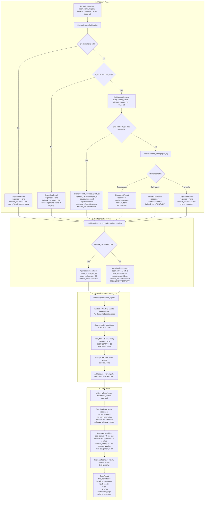
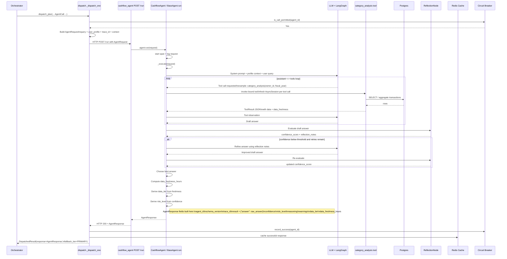

```mermaid
flowchart TD
    subgraph D["1. Dispatch Phase"]
        A["dispatch_plan(plan, user_profile, registry, breaker, response_cache, trace_id)"]
        A --> B["For each AgentCall in plan"]

        B --> C{"Breaker allows call?"}
        C -- "No" --> D1["DispatchedResult<br/>response = None<br/>fallback_tier = FAILURE<br/>error = 'circuit breaker open'"]

        C -- "Yes" --> E{"Agent exists in registry?"}
        E -- "No" --> D2["DispatchedResult<br/>response = None<br/>fallback_tier = FAILURE<br/>error = 'agent not found in registry'"]

        E -- "Yes" --> F["Build AgentRequest<br/>query + user_profile + allowed_owner_ids + trace_id"]
        F --> G{"Live HTTP POST /run succeeds?"}

        G -- "Yes" --> H["breaker.record_success(agent_id)<br/>response_cache.set(agent_id, request, response)<br/>DispatchedResult<br/>response = AgentResponse<br/>fallback_tier = PRIMARY"]

        G -- "No" --> I["breaker.record_failure(agent_id)"]
        I --> J{"Redis cache hit?"}

        J -- "Fresh cache" --> K["DispatchedResult<br/>response = cached.response<br/>fallback_tier = SECONDARY"]
        J -- "Stale cache" --> L["DispatchedResult<br/>response = cached.response<br/>fallback_tier = TERTIARY"]
        J -- "No cache" --> M["DispatchedResult<br/>response = None<br/>fallback_tier = FAILURE<br/>error = exception"]
    end

    subgraph C1["2. Confidence Input Build"]
        N["_build_confidence_inputs(dispatched_results)"]
        O{"fallback_tier == FAILURE?"}
        P["AgentConfidenceInput<br/>agent_id = r.agent_id<br/>base_confidence = 0.0<br/>fallback_tier = FAILURE"]
        Q["AgentConfidenceInput<br/>agent_id = r.agent_id<br/>base_confidence = r.response.confidence<br/>fallback_tier = PRIMARY / SECONDARY / TERTIARY"]
    end

    subgraph C2["3. Baseline Composition"]
        R["compose(confidence_inputs)"]
        S["Exclude FAILURE agents from average<br/>Put them into baseline.gaps"]
        T["Convert active confidence<br/>0.0-1.0 -> 0-100"]
        U["Apply fallback-tier penalty<br/>PRIMARY = 0<br/>SECONDARY = -10<br/>TERTIARY = -25"]
        V["Average adjusted active scores<br/>baseline.score"]
        W["Add baseline warnings for<br/>SECONDARY / TERTIARY"]
    end

    subgraph CR["4. Critic Phase"]
        X["critic_evaluate(query, dispatched_results, baseline)"]
        Y["Run checks on active responses<br/>surplus mismatch<br/>net worth mismatch<br/>time horizon mismatch<br/>unknown schema_version"]
        Z["Compute penalties<br/>gap_penalty = 5 per gap<br/>inconsistency_penalty = 5 per flag<br/>schema_penalty = 3 per schema warning<br/>max total penalty = 30"]
        AA["final_confidence = max(0, baseline.score - total_penalty)"]
        AB["CriticResult<br/>final_confidence<br/>baseline_confidence<br/>total_penalty<br/>gaps<br/>warnings<br/>consistency_flags<br/>schema_warnings"]
    end

    D1 --> N
    D2 --> N
    H --> N
    K --> N
    L --> N
    M --> N

    N --> O
    O -- "Yes" --> P
    O -- "No" --> Q

    P --> R
    Q --> R

    R --> S
    S --> T
    T --> U
    U --> V
    V --> W
    W --> X

    X --> Y
    Y --> Z
    Z --> AA
    AA --> AB

```

```mermaid
sequenceDiagram
    participant Orch as Orchestrator
    participant Disp as dispatch._dispatch_one
    participant API as cashflow_agent POST /run
    participant Agent as CashflowAgent / BaseAgent.run
    participant LLM as LLM + LangGraph
    participant Tool as category_analysis tool
    participant DB as Postgres
    participant Refl as ReflectionNode
    participant Cache as Redis Cache
    participant Breaker as Circuit Breaker

    Orch->>Disp: dispatch_plan(... AgentCall ...)
    Disp->>Breaker: is_call_permitted(agent_id)
    Breaker-->>Disp: Yes

    Disp->>Disp: Build AgentRequest\nquery + user_profile + trace_id + context
    Disp->>API: HTTP POST /run with AgentRequest

    API->>Agent: agent.run(request)
    Agent->>Agent: start span + log request
    Agent->>Agent: _execute(request)

    Agent->>LLM: System prompt + profile context + user query

    loop assistant <-> tools loop
        LLM-->>Agent: Tool call requested\nexample: category_analysis(owner_id, fiscal_year)
        Agent->>Tool: invoke bound tool\nfresh AsyncSession per tool call
        Tool->>DB: SELECT / aggregate transactions
        DB-->>Tool: rows
        Tool-->>Agent: ToolResult JSON\nwith data + data_freshness
        Agent->>LLM: Tool observation
        LLM-->>Agent: Draft answer
    end

    Agent->>Refl: Evaluate draft answer
    Refl-->>Agent: confidence_score + reflection_notes

    alt confidence below threshold and retries remain
        Agent->>LLM: Refine answer using reflection notes
        LLM-->>Agent: Improved draft answer
        Agent->>Refl: Re-evaluate
        Refl-->>Agent: updated confidence_score
    end

    Agent->>Agent: Choose best answer
    Agent->>Agent: Compute data_freshness_hours
    Agent->>Agent: Derive data_tier from freshness
    Agent->>Agent: Derive risk_level from confidence

    Note right of Agent: AgentResponse fields built here:\nagent_id\nschema_version\ntrace_id\nresult = {"answer": raw_answer}\nconfidence\nrisk_level\nreasoning\nwarnings\ndata_tier\ndata_freshness_hours

    Agent-->>API: AgentResponse
    API-->>Disp: HTTP 200 + AgentResponse

    Disp->>Breaker: record_success(agent_id)
    Disp->>Cache: cache successful response
    Disp-->>Orch: DispatchedResult(response=AgentResponse,\nfallback_tier=PRIMARY)

```